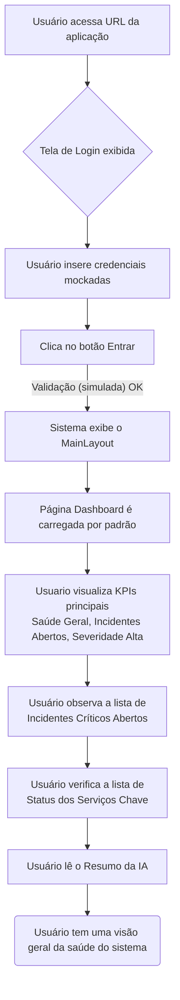

```mermaid
graph TD
    A[Usuário acessa URL da aplicação] --> B{Tela de Login exibida}
    B --> C[Usuário insere credenciais mockadas]
    C --> D[Clica no botão Entrar]
    D -- Validação (simulada) OK --> E[Sistema exibe o MainLayout]
    E --> F[Página Dashboard é carregada por padrão]
    F --> G[Usuario visualiza KPIs principais<br>Saúde Geral, Incidentes Abertos, Severidade Alta]
    G --> H[Usuário observa a lista de<br>Incidentes Críticos Abertos]
    H --> I[Usuário verifica a lista de<br>Status dos Serviços Chave]
    I --> J[Usuário lê o Resumo da IA]
    J --> K(Usuário tem uma visão geral da saúde do sistema)
```