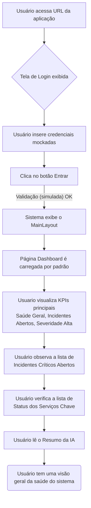
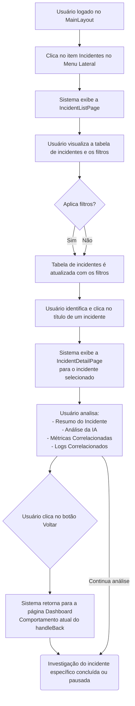
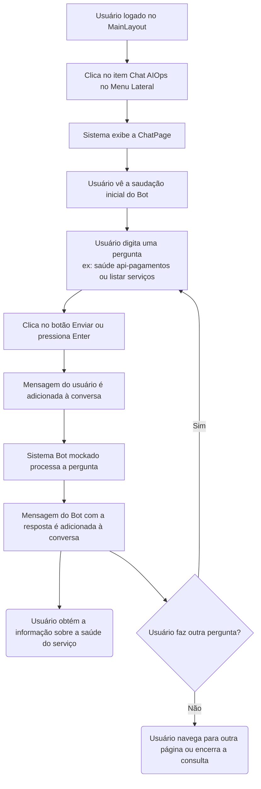
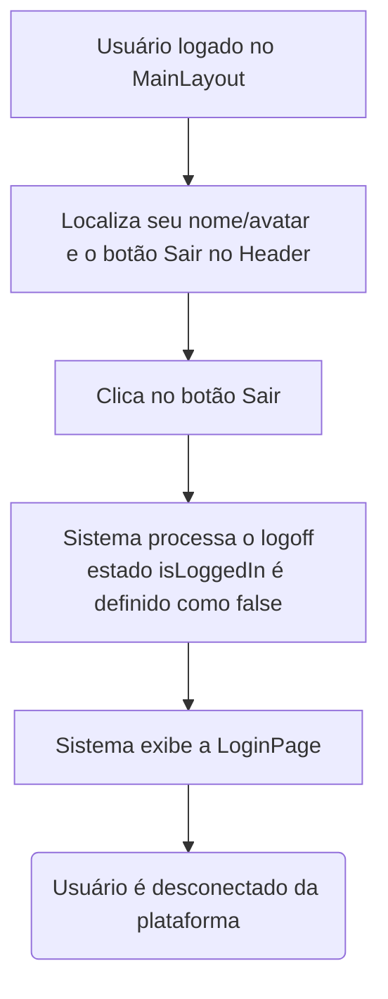

# Jornadas de usuario

### Acesso Inicial e Visão Geral da Saúde do Sistema
  

  
### Investigação Detalhada de Incidentes

  
### Consulta Rápida de Saúde de Serviço via Chat AIOps
  

### Encerramento da Sessão (Logoff)
  
